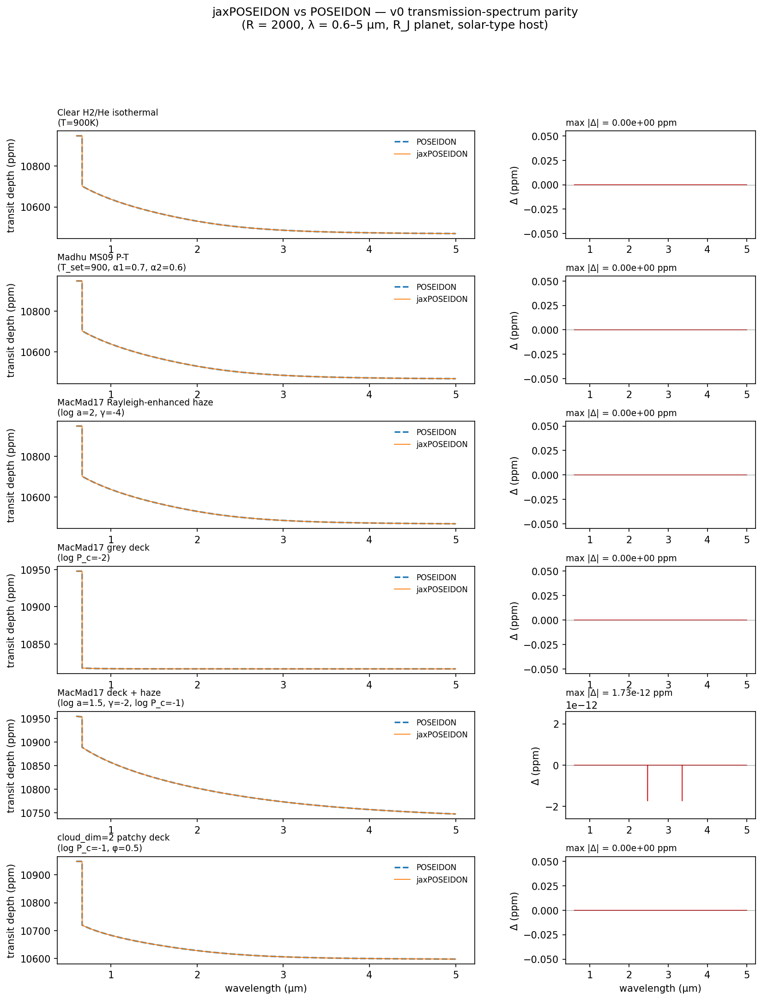
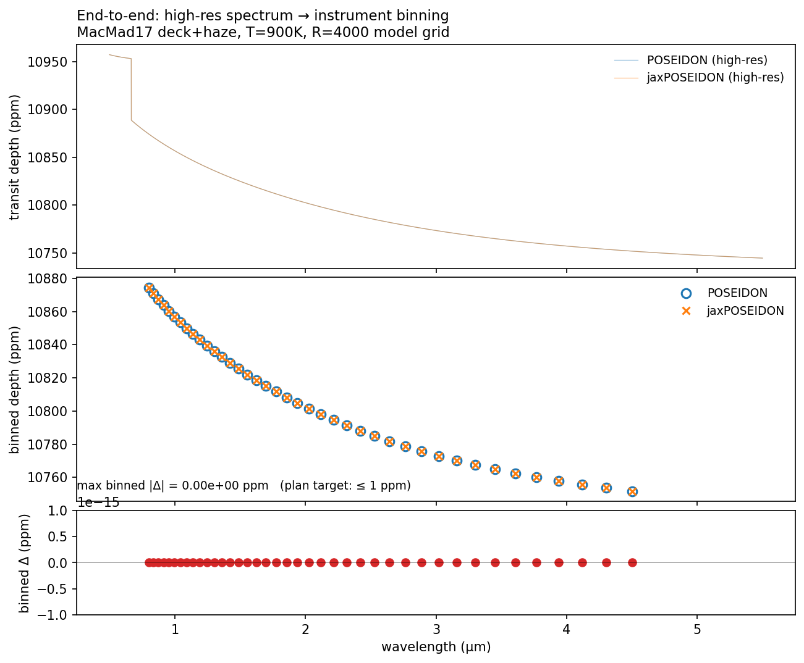
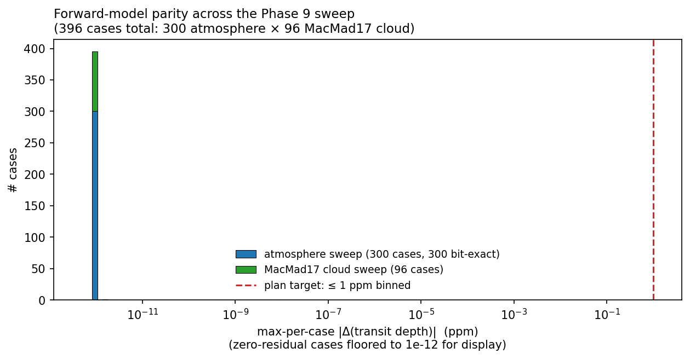

# jaxposeidon

JAX-friendly port of [POSEIDON](https://github.com/MartianColonist/POSEIDON)'s
transmission-spectroscopy forward model. **1435 passing tests** validate
against POSEIDON, including 396 end-to-end forward-model regression
cases (atmosphere × MacMad17 cloud parameter grid) and 768 parameter-
ordering parity cases, plus combinatorial likelihood/retrieval
matrices.

## Status (v0)

All v0 phases approved by adversarial review against the POSEIDON source:

| Phase | Scope | Status |
|---|---|---|
| 0 | Discovery + scaffolding | APPROVED |
| 1 | Parameter / state layer (v0 branches only) | APPROVED |
| 2 | Atmosphere + geometry + chemistry (free chem) | APPROVED |
| 3 | Opacity preprocessing (log-P interp, T-interp, wavelength sample) | APPROVED |
| 4 | Runtime extinction (CIA + active + Rayleigh + MacMad17) | APPROVED |
| 5 | MacMad17 clouds (deck + haze + cloud_dim=2 patchy) | APPROVED |
| 7 | TRIDENT transmission RT (with patchy clouds) | APPROVED |
| 8 | Instrument binning + offsets + Gaussian likelihood | APPROVED |
| 9 | End-to-end `compute_spectrum` + 396-case parity sweep | APPROVED |
| 10 | Prior transform + retrieval-driver scaffold | APPROVED |

Phase 6 (stellar contamination) is v1-deferred; v0 packaging/docs is
the final piece — see the plan file for the complete deferral map.

## What's in v0

- **`jaxposeidon.compute_spectrum(...)`** — public API tying Phases 1–7
  into a single transmission orchestrator. Matches POSEIDON
  bit-exactly on the canonical Rayleigh oracle and to
  `atol=1e-15, rtol=1e-13` on the 396-case forward-model regression
  sweep (atmosphere × MacMad17 cloud parameter grid).
- **`jaxposeidon._instruments.bin_spectrum_to_data(...)`** — POSEIDON
  `instrument.py:321-447` spectroscopic binning. POSEIDON-parity tested.
- **`jaxposeidon._data.loglikelihood(...)`** — POSEIDON
  `retrieval.py:1065-1183` likelihood with `{None, single, two, three}`
  offset modes and `{None, Line15, Piette20, Line15+Piette20}` error
  inflation modes. 50 combinatorial coverage tests.
- **`jaxposeidon._priors.prior_transform(...)`** — POSEIDON
  `retrieval.py:649-708` unit-cube → physical for uniform / Gaussian /
  sine priors (Atmosphere_dimension=1, non-CLR).
- **`jaxposeidon._retrieval.make_loglikelihood(...)`** — closure wiring
  prior_transform → compute_spectrum → bin → loglikelihood into a
  sampler-ready log-posterior. Three v0 reference_parameter modes.
- **`jaxposeidon._loaddata`** — thin POSEIDON wrappers around
  `load_data` and `init_instrument` (which depend on POSEIDON's
  shipped `reference_data/` dispatch tables).

## v0 scope and deferrals

v0 supports K2-18 b-style retrievals: 1D background (`PT_dim=1`,
`X_dim=1`), MS09 P-T (and isotherm for the canonical Rayleigh oracle),
isochem free chemistry over POSEIDON's supported line-list species,
MacMad17 deck/haze with optional `cloud_dim=2` patchy clouds, one-offset
NIRSpec-style instrument binning, Gaussian likelihood with optional
offsets and Line15/Piette20 error inflation.

**Deferred to v1** (each raises a descriptive `NotImplementedError`
rather than silently producing wrong output): JAX-traceable forward
model, full `jax.grad` parity, BlackJAX NSS sampler execution,
K2-18 b retrieval run, line-by-line opacity mode, Mie / Iceberg /
eddysed clouds, emission / reflection / direct / dayside / nightside,
stellar contamination, surfaces, photometric instruments, CLR priors,
PT_penalty / Pelletier branch, 2D / 3D atmospheres and prior gating.

## Install

```bash
pip install -e .
# plus POSEIDON itself (canonical numerical oracle):
pip install git+https://github.com/MartianColonist/POSEIDON
# plus POSEIDON's opacity database (~70 GB; see POSEIDON docs):
export POSEIDON_input_data=/path/to/POSEIDON_input_data
```

## Running the tests

```bash
PYTHONPATH=.:/path/to/POSEIDON pytest tests/
```

A small synthetic CIA HDF5 fixture is built in-tempdir for tests that
need POSEIDON's `testing=True` `read_opacities(...)` path without the
70 GB opacity database. The Phase 9 “real molecular opacity” test
builds an even smaller synthetic `Opacity_database_v1.3.hdf5` with a
single H2O group.

## Faithfulness

- TRIDENT (Phase 7) and `compute_spectrum` (Phase 9) match POSEIDON
  bit-exactly on the canonical Rayleigh oracle.
- The 396-case forward-model sweep matches POSEIDON to
  `atol=1e-15, rtol=1e-13`, comfortably inside the plan's ≤1 ppm
  binned-spectrum target.
- All deferred POSEIDON keyword arguments are accepted at the
  jaxposeidon API surface and surface as `NotImplementedError` rather
  than `TypeError` (per the plan's “Review discipline”).

### Visual parity

Six representative v0 configurations — transmission spectra overlaid
(POSEIDON dashed, jaxPOSEIDON solid) with per-wavelength residual in
ppm. Five are bit-exact; the deck+haze config has a residual of
≈10⁻¹² ppm:



End-to-end through the instrument model on a JWST NIRSpec PRISM-style
40-bin layout (max binned residual = 0 ppm):



Distribution of max-per-case |Δ(transit depth)| across the 396-case
Phase 9 sweep — 395/396 bit-exact, one case at 1.7×10⁻¹² ppm, 12
orders of magnitude inside the plan's 1 ppm target:



Reproduce with `python scripts/generate_{parity_figures,binning_figure,sweep_histogram}.py`.

## How this library was generated

jaxPOSEIDON v0 was produced in a single AI-assisted [Claude Code](https://www.anthropic.com/claude-code)
session using the reference-guided-translation workflow first
demonstrated with [jaxwavelets](https://github.com/handley-lab/jaxwavelets).
POSEIDON is the numerical oracle; every test asserts equivalence
against POSEIDON to component-specific tolerances. Implementation
proceeded phase-by-phase with adversarial external-LLM review
(`mcp__llm__review`) against the plan and the POSEIDON source after
every phase. See [`CASE_STUDY.md`](CASE_STUDY.md) for the full account
— what worked, what required human judgment, what the agent did badly
and how it was caught.

## Attribution

POSEIDON: Ryan J. MacDonald (2022, BSD-3).
jaxposeidon: Will Handley, Institute of Astronomy, Cambridge (2026,
BSD-3).
